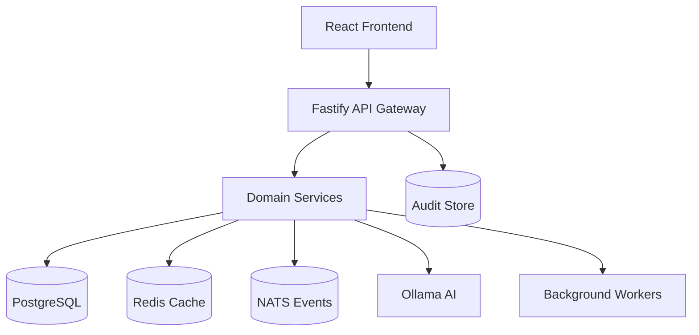

# New Engineer Onboarding Guide

**Welcome to Political Sphere!** This guide will help you get up and running quickly and understand our development processes, architecture, and culture.

## Table of Contents

- [First Day Setup](#first-day-setup)
- [Development Environment](#development-environment)
- [Project Overview](#project-overview)
- [Architecture Deep Dive](#architecture-deep-dive)
- [Development Workflow](#development-workflow)
- [Key Processes](#key-processes)
- [Resources & Support](#resources--support)

---

## First Day Setup

### Prerequisites

- **Node.js**: 18.0.0 or higher (LTS recommended)
- **npm**: Latest version (comes with Node.js)
- **Git**: For version control
- **Docker & Docker Compose**: Recommended for full development environment
- **VS Code**: Recommended editor with extensions

### Initial Setup (15-30 minutes)

1. **Clone the repository**
   ```bash
   git clone https://github.com/political-sphere/political-sphere.git
   cd political-sphere
   ```

2. **Install dependencies**
   ```bash
   npm install
   ```

3. **Set up development environment**
   ```bash
   # Start all services with Docker (recommended)
   npm run dev

   # Or start individual services
   npm run dev:api          # Start API server
   npm run dev:web          # Start frontend
   npm run dev:game-server  # Start game simulation
   ```

4. **Verify setup**
   ```bash
   npm run preflight  # Run health checks
   ```

5. **Install VS Code extensions** (recommended)
   - ESLint
   - Prettier
   - TypeScript Importer
   - GitLens
   - Docker
   - GitHub Actions

---

## Development Environment

### Local Development Stack

Political Sphere runs on a **zero-budget architecture** using free, local-first tools:

- **Frontend**: React 19 + Vite + TypeScript
- **Backend**: Node.js 22 + Fastify + TypeScript
- **Database**: PostgreSQL (Docker) + Prisma ORM
- **Cache/Queues**: Redis (Docker)
- **AI**: Ollama (local models only)
- **Deployment**: Docker Compose for development

### Key Scripts

```bash
# Development
npm run dev              # Start all services
npm run dev:api          # API only
npm run dev:web          # Frontend only

# Quality Gates
npm run lint             # ESLint
npm run type-check       # TypeScript
npm run test             # Unit tests
npm run test:coverage    # Tests with coverage

# Database
npm run db:migrate       # Run migrations
npm run db:seed          # Seed development data

# Production Build
npm run build:web        # Build frontend
npm run build:api        # Build API
```

### Docker Development Environment

For the full experience, use Docker Compose:

```bash
# Start complete stack
docker-compose -f docker-compose.dev.yml up

# View logs
docker-compose -f docker-compose.dev.yml logs -f

# Stop services
docker-compose -f docker-compose.dev.yml down
```

---

## Project Overview

### What is Political Sphere?

Political Sphere is an **immersive multiplayer political simulation game** inspired by the UK's parliamentary system. Players engage in realistic political discourse, draft legislation, form coalitions, and cast votes that shape virtual nations.

**Key Characteristics:**
- **Solo developer project** leveraging AI as collaborative coding partner
- **Nx monorepo** with 12+ applications and 17+ shared libraries
- **TypeScript-first** with strict type safety
- **Zero-budget architecture** (no paid cloud services)
- **Educational focus** on democratic principles

### Development Philosophy

- **Iterative Excellence**: Prioritize momentum over perfection
- **AI-Augmented Development**: AI assists but human oversight required
- **Democratic Integrity**: No manipulation of political outcomes
- **Security First**: Zero-trust principles throughout
- **Accessibility Mandatory**: WCAG 2.2 AA+ compliance required

### Project Structure

```
apps/                    # Deployable applications
├── api/                 # Main REST/GraphQL API
├── web/                 # React frontend
├── game-server/         # Game simulation engine
├── worker/              # Background job processing
└── infrastructure/      # Deployment configurations

libs/                    # Shared libraries
├── shared/              # Common utilities
├── domain-*/            # Business logic
├── ui/                  # Design system
└── testing/             # Test utilities

docs/                    # Comprehensive documentation
├── 00-foundation/       # Project basics
├── 04-architecture/     # Technical architecture
├── 05-engineering-and-devops/  # Development processes
└── 06-security-and-risk/ # Security policies
```

---

## Architecture Deep Dive

### System Architecture

Political Sphere uses a **modular monolith architecture** with domain-driven design:



### Key Design Patterns

1. **Domain-Driven Design (DDD)**
   - Rich domain models with ubiquitous language
   - Clear bounded contexts
   - Repository pattern for data access

2. **CQRS Pattern**
   - Command-Query separation for complex domains
   - Event sourcing for audit trails

3. **Event-Driven Architecture**
   - Asynchronous communication via Redis/NATS
   - Loose coupling between services

### Security Architecture

- **Zero-Trust Model**: No implicit trust, verify everything
- **JWT Authentication**: Secure session management
- **Row-Level Security**: Database-level access control
- **Input Validation**: Zod schemas for runtime type safety
- **Audit Logging**: Tamper-evident event trails

### Data Architecture

**Core Entities:**
- `User` - Player accounts
- `World` - Game instances/tenants
- `Party` - Political parties
- `MP` - Members of Parliament (player or NPC)
- `Bill` - Legislative proposals
- `Vote` - Recorded votes
- `Debate` - Parliamentary discussions

**Database Design:**
- PostgreSQL with PostGIS for spatial data
- Prisma ORM for type-safe queries
- Row-Level Security (RLS) for multi-tenancy
- Full-text search capabilities

---

## Development Workflow

### Git Workflow

We use **trunk-based development** with feature branches:

```bash
# Create feature branch
git checkout -b feature/your-feature-name

# Make changes with conventional commits
git commit -m "feat: add user authentication"

# Push and create PR
git push origin feature/your-feature-name
```

**Commit Message Format:**
```
type(scope): description

Types: feat, fix, docs, style, refactor, test, chore
```

### Code Quality Gates

All changes must pass:

1. **Linting**: ESLint with auto-fix
2. **Type Checking**: TypeScript strict mode
3. **Unit Tests**: 80%+ coverage target
4. **Integration Tests**: API and database testing
5. **Security Scans**: Dependency and code scanning
6. **Accessibility**: WCAG 2.2 AA+ compliance

### Pull Request Process

1. **Create PR** with descriptive title and body
2. **CI/CD runs** quality gates automatically
3. **Code review** by at least 2 team members
4. **Security review** for sensitive changes
5. **Merge** after approval

### Testing Strategy

**Test Pyramid:**
- **Unit Tests** (80%+ coverage): Business logic, utilities
- **Integration Tests**: API endpoints, database operations
- **E2E Tests**: Critical user journeys
- **Security Tests**: Input validation, authentication flows
- **Performance Tests**: Load testing and benchmarking

---

## Key Processes

### Incident Response

**When things go wrong:**

1. **Declare incident** in PagerDuty/Slack
2. **Assess impact** and notify stakeholders
3. **Contain damage** and restore service
4. **Investigate root cause**
5. **Document lessons learned**

**Key Resources:**
- [Incident Response Plan](../docs/09-observability-and-ops/INCIDENT-RESPONSE-PLAN.md)
- [Disaster Recovery Runbook](../docs/09-observability-and-ops/DISASTER-RECOVERY-RUNBOOK.md)

### Security Processes

**Security-First Development:**
- All changes reviewed for security impact
- Dependencies scanned weekly
- Secrets never committed to code
- Regular security audits

**Key Resources:**
- [Security Policy](../SECURITY.md)
- [Security Architecture](../docs/06-security-and-risk/security.md)

### Deployment Process

**Staging Deployment:** Automatic on main branch merge
**Production Deployment:** Manual approval required

**Key Resources:**
- [Deployment Runbook](../docs/09-observability-and-ops/deployment-runbook.md)
- [Production Readiness Checklist](../docs/09-observability-and-ops/PRODUCTION-READINESS-CHECKLIST.md)

### AI Governance

AI is used extensively for development but with strict governance:

- **Democratic Integrity**: AI cannot influence political outcomes
- **Human Oversight**: All AI-generated code reviewed by humans
- **Transparency**: AI decisions logged and auditable
- **Ethical Boundaries**: Constitutional framework prevents bias

**Key Resources:**
- [AI Governance](../docs/07-ai-and-simulation/ai-governance.md)
- [.blackboxrules](/.blackboxrules) - AI assistant guidelines

---

## Resources & Support

### Documentation

**Getting Started:**
- [Project README](../README.md) - Overview and setup
- [Contributing Guide](../CONTRIBUTING.md) - Development processes
- [Architecture Overview](../docs/04-architecture/architecture.md) - System design

**Technical References:**
- [API Documentation](../docs/04-architecture/api.md) - Endpoint specifications
- [Database Schema](../docs/04-architecture/data-architecture/data-models-and-erd.md) - Data models
- [Coding Standards](../docs/05-engineering-and-devops/coding-standards-typescript-react.md) - Code quality

**Operational:**
- [CI/CD Architecture](../docs/05-engineering-and-devops/ci-cd-architecture.md) - Build pipelines
- [Security Policies](../docs/06-security-and-risk/security.md) - Security requirements
- [Deployment Runbook](../docs/09-observability-and-ops/deployment-runbook.md) - Release process

### Communication

- **Slack**: #dev-team, #incidents, #security
- **GitHub**: Issues for bugs, Discussions for questions
- **Documentation**: All processes documented in `/docs`

### Getting Help

1. **Check documentation first** - Most answers are in `/docs`
2. **Search existing issues** - Common problems already solved
3. **Ask in Slack** - Quick questions and discussions
4. **Create GitHub issue** - For bugs or feature requests
5. **Pair programming** - Schedule time with team members

### Key Contacts

- **Tech Lead**: [Name] - Architecture and technical decisions
- **Security Lead**: [Name] - Security reviews and incidents
- **DevOps Lead**: [Name] - Infrastructure and deployments
- **Product Lead**: [Name] - Feature priorities and requirements

---

## Next Steps

### Week 1 Goals

- [ ] Complete environment setup
- [ ] Run full test suite locally
- [ ] Make your first code change
- [ ] Submit your first pull request
- [ ] Attend team standup

### Learning Path

1. **Week 1**: Environment setup, basic development workflow
2. **Week 2**: Deep dive into domain logic, make first feature contribution
3. **Week 3**: Learn deployment process, handle first incident
4. **Week 4**: Take ownership of a component, mentor others

### Success Metrics

- **Code Quality**: All PRs pass quality gates
- **Velocity**: Contributing to sprint goals
- **Collaboration**: Active participation in reviews and discussions
- **Learning**: Understanding of system architecture and processes

---

**Welcome aboard!** We're excited to have you join the Political Sphere team. Remember: our mission is to build systems that teach democratic principles through immersive experience. Every contribution helps advance that goal.

For questions or help, don't hesitate to reach out. Let's build something meaningful together! 🚀