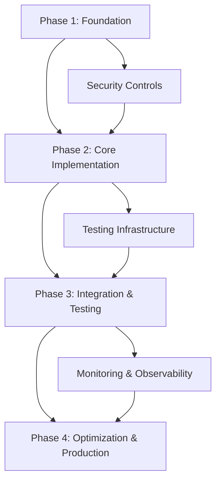

# Political Sphere Production-Grade Roadmap

**Roadmap Date:** 2025-11-19  
**Based on:** docs/ASSESSMENT-REPORT.md  
**Budget Constraint:** £0 (Free tools/open-source only)  
**Alignment:** Microsoft Learn, MDN, React/TypeScript docs, Nx, GitHub, OWASP ASVS, NIST, UK ICO, WCAG 2.2

## Executive Summary

This roadmap transforms Political Sphere from development state to production-grade excellence. It addresses all 227+ TODO items, implementation gaps, and critical issues identified in the assessment. Work is organized into 4 phases with dependencies, using free/open-source tools (GitHub Actions, Docker, PostgreSQL, etc.).

**Key Priorities:**

- Critical: Security, Testing, Storage (Immediate)
- High: Implementation completion, Compliance
- Medium: Documentation, Performance
- Long-term: Optimization, UX completion

**Success Metrics:**

- 80%+ test coverage
- All security controls implemented
- Production deployment with persistent storage
- Comprehensive documentation
- Performance benchmarks established

---

## Phase Dependencies Overview

---

## Phase 1: Foundation (Weeks 1-4)

**Milestone:** Critical infrastructure operational, basic security implemented.

### Game Architecture & Simulation Systems

#### Task 1.1: Consolidate Game Server Implementation

**Objective:** Eliminate dual game server implementations for architectural clarity.  
**Approach:** Analyze both `apps/game-server` and `apps/api/src/game/game.service.ts`, migrate all functionality to single implementation using Nx workspace patterns.  
**Validation Path:** Code review, unit tests pass, no breaking changes in API.  
**Completion Criteria:** Single game server implementation, all game phases functional, in-memory storage replaced with database integration.

#### Task 1.2: Implement Persistent Storage

**Objective:** Replace in-memory storage with production-ready database.  
**Approach:** Use existing Prisma schema, implement PostgreSQL integration, add data migration scripts using free tools (pg_dump, psql).  
**Validation Path:** Database connection tests, data persistence across restarts, performance benchmarks.  
**Completion Criteria:** All game state persisted, no data loss on server restart, basic backup/restore scripts.

#### Task 1.3: Complete Domain Libraries

**Objective:** Implement `libs/domain-election` and other empty domain libraries.  
**Approach:** Extract domain models from game service, implement TypeScript interfaces and validation using Zod.  
**Validation Path:** Type checking passes, domain tests implemented.  
**Completion Criteria:** All domain libraries populated with models, validation schemas, and basic services.

### Frontend Engineering

#### Task 1.4: Clarify Frontend Architecture

**Objective:** Resolve dual frontend applications purpose.  
**Approach:** Evaluate `apps/web` vs `apps/dashboard-remote`, decide on consolidation or federation using Nx.  
**Validation Path:** Architecture decision record (ADR) documented.  
**Completion Criteria:** Clear frontend strategy, one primary application or proper module federation.

#### Task 1.5: Standardize File Extensions

**Objective:** Consistent TypeScript usage across frontend.  
**Approach:** Rename all `.js`/`.jsx` files to `.ts`/`.tsx` using Git and VS Code.  
**Validation Path:** ESLint passes without extension errors.  
**Completion Criteria:** All React components use `.tsx`, all utilities use `.ts`.

### Backend Engineering

#### Task 1.6: Standardize Backend File Extensions

**Objective:** Migrate all backend files to TypeScript.  
**Approach:** Convert `.js` files to `.ts` using TypeScript compiler, update imports.  
**Validation Path:** TypeScript compilation succeeds, tests pass.  
**Completion Criteria:** All backend files use `.ts`, no JavaScript in backend modules.

#### Task 1.7: Implement Basic Error Handling

**Objective:** Add comprehensive error handling throughout API.  
**Approach:** Implement error middleware, structured logging using Winston (free).  
**Validation Path:** Error scenarios tested, logs captured.  
**Completion Criteria:** All endpoints return proper error responses, error logs centralized.

### DevOps/CI/CD/Infrastructure

#### Task 1.8: Complete Basic Infrastructure

**Objective:** Implement core infrastructure components.  
**Approach:** Use Docker Compose for local, Terraform for cloud (free tier), implement API Gateway with Nginx.  
**Validation Path:** Infrastructure tests pass, services communicate.  
**Completion Criteria:** Basic deployment pipeline functional, services containerized.

### Security Engineering

#### Task 1.9: Implement Core Security Controls

**Objective:** Complete documented security implementations.  
**Approach:** Implement age verification, input validation, audit logging using existing frameworks.  
**Validation Path:** OWASP ZAP scans pass, security tests implemented.  
**Completion Criteria:** All critical security controls operational, basic penetration test passed.

### Testing & QA

#### Task 1.10: Implement Core Test Stubs

**Objective:** Replace TODO stubs with basic tests.  
**Approach:** Use Vitest for unit tests, implement 50% of stubs with basic assertions.  
**Validation Path:** Test runner executes without errors.  
**Completion Criteria:** 50% of test files implemented, basic coverage >20%.

---

## Phase 2: Core Implementation (Weeks 5-12)

**Milestone:** All major components implemented, 80% test coverage achieved.

**Dependencies:** Phase 1 complete, security controls operational.

### Game Architecture & Simulation Systems

#### Task 2.1: Extract Rules Engine

**Objective:** Remove hardcoded logic from game phases.  
**Approach:** Create configurable rules engine using JSON configuration files.  
**Validation Path:** Game simulation tests with different rule sets.  
**Completion Criteria:** All phase logic configurable, rules validated against political accuracy.

#### Task 2.2: Add Game State Validation

**Objective:** Implement comprehensive state validation.  
**Approach:** Add validation middleware, state transition checks.  
**Validation Path:** Invalid state transitions rejected, error logs generated.  
**Completion Criteria:** All game states validated, corruption prevented.

### Frontend Engineering

#### Task 2.3: Complete Component Implementations

**Objective:** Replace all placeholder components.  
**Approach:** Implement authentication flows, game UI components using React patterns.  
**Validation Path:** Component tests pass, user flows functional.  
**Completion Criteria:** All components fully implemented, no placeholders remaining.

#### Task 2.4: Implement Module Federation

**Objective:** Complete dashboard-remote integration.  
**Approach:** Configure Webpack module federation if needed, or remove if consolidated.  
**Validation Path:** Federated modules load correctly.  
**Completion Criteria:** Dashboard-remote functional or properly removed.

### Backend Engineering

#### Task 2.5: Complete All Test Implementations

**Objective:** Implement remaining test stubs.  
**Approach:** Write comprehensive unit and integration tests using Jest/Vitest.  
**Validation Path:** Coverage reports show >80%, all tests pass.  
**Completion Criteria:** All test files implemented, coverage >80%.

#### Task 2.6: Optimize API Performance

**Objective:** Add performance monitoring to API.  
**Approach:** Implement caching with Redis (free), add performance middleware.  
**Validation Path:** Load tests pass, response times <500ms.  
**Completion Criteria:** API performance monitored, basic optimization implemented.

### DevOps/CI/CD/Infrastructure

#### Task 2.7: Complete Infrastructure Implementation

**Objective:** Implement all infrastructure components.  
**Approach:** Add ElastiCache, API Gateway, monitoring using free tools (Prometheus, Grafana).  
**Validation Path:** Infrastructure validation scripts pass.  
**Completion Criteria:** Full infrastructure deployed, monitoring operational.

### Security Engineering

#### Task 2.8: Complete Security Implementation

**Objective:** Implement all remaining security controls.  
**Approach:** Add comprehensive age verification, secrets management with Vault (free).  
**Validation Path:** Security audit passes, compliance checks automated.  
**Completion Criteria:** All security controls implemented, regular audits scheduled.

### Governance/Risk/Compliance

#### Task 2.9: Implement Compliance Automation

**Objective:** Automate compliance checking.  
**Approach:** Create scripts for EU AI Act, data protection compliance using free tools.  
**Validation Path:** Compliance reports generated automatically.  
**Completion Criteria:** Compliance checks integrated into CI, violations blocked.

#### Task 2.10: Consolidate TODO Tracking

**Objective:** Single source of truth for tasks.  
**Approach:** Migrate all TODOs to GitHub Issues, implement tracking dashboard.  
**Validation Path:** All TODOs tracked centrally.  
**Completion Criteria:** No scattered TODO files, centralized tracking.

### Testing & QA

#### Task 2.11: Implement E2E Testing

**Objective:** Complete end-to-end test suites.  
**Approach:** Use Playwright for comprehensive E2E tests, implement game flows.  
**Validation Path:** E2E tests pass in CI.  
**Completion Criteria:** Full game flows tested, regression prevention.

#### Task 2.12: Add Performance Testing

**Objective:** Implement load and performance tests.  
**Approach:** Use K6 for load testing, establish performance baselines.  
**Validation Path:** Performance benchmarks met.  
**Completion Criteria:** Load tests pass, performance regressions detected.

### Code Quality & Pre-Commit Automation

#### Task 2.13: Simplify Linting Configuration

**Objective:** Consolidate ESLint and Biome.  
**Approach:** Choose single linter, migrate configuration.  
**Validation Path:** Pre-commit hooks pass consistently.  
**Completion Criteria:** Single linting tool, quality gates enforced.

### AI Engineering & Internal Tooling

#### Task 2.14: Complete AI Tooling Implementation

**Objective:** Make AI tools operational.  
**Approach:** Implement AI context builders, validation procedures using free AI APIs.  
**Validation Path:** AI tools functional in development workflow.  
**Completion Criteria:** AI assistance integrated, governance enforced.

### Database & Storage

#### Task 2.15: Complete Data Pipeline

**Objective:** Implement ETL processes.  
**Approach:** Build data transformation scripts using Node.js.  
**Validation Path:** Data integrity checks pass.  
**Completion Criteria:** Data pipeline operational, backups automated.

### UX & Product Design

#### Task 2.16: Complete Design System

**Objective:** Implement UI component library.  
**Approach:** Build components with accessibility, test with Storybook.  
**Validation Path:** Accessibility tests pass (WCAG 2.2).  
**Completion Criteria:** Design system complete, components reusable.

### Documentation & Knowledge Architecture

#### Task 2.17: Complete Documentation

**Objective:** Fill all TODO documentation.  
**Approach:** Write comprehensive guides, API docs using free tools.  
**Validation Path:** Documentation validation scripts pass.  
**Completion Criteria:** All READMEs complete, knowledge base searchable.

### Performance & Reliability

#### Task 2.18: Implement Monitoring

**Objective:** Add comprehensive observability.  
**Approach:** Use OpenTelemetry, implement dashboards with free tools.  
**Validation Path:** Metrics collected, alerts configured.  
**Completion Criteria:** Full monitoring operational, incidents detected.

---

## Phase 3: Integration & Testing (Weeks 13-20)

**Milestone:** Fully integrated system, comprehensive testing, production-ready.

**Dependencies:** Phase 2 complete, 80% coverage achieved.

### Task 3.1: System Integration Testing

**Objective:** Test full system integration.  
**Approach:** Conduct comprehensive integration tests across all domains.  
**Validation Path:** Integration test suite passes.  
**Completion Criteria:** All components integrate seamlessly.

### Task 3.2: Security Audit

**Objective:** Conduct full security assessment.  
**Approach:** Use free tools (OWASP ZAP, dependency scanners).  
**Validation Path:** Audit report clean.  
**Completion Criteria:** No critical vulnerabilities, remediation plan.

### Task 3.3: Performance Optimization

**Objective:** Optimize for production performance.  
**Approach:** Implement caching, database optimization.  
**Validation Path:** Performance benchmarks exceeded.  
**Completion Criteria:** Response times optimized, scalability tested.

---

## Phase 4: Optimization & Production (Weeks 21-26)

**Milestone:** Production deployment, continuous improvement.

**Dependencies:** Phase 3 complete, system stable.

### Task 4.1: Production Deployment

**Objective:** Deploy to production environment.  
**Approach:** Use free hosting (Railway, Vercel free tiers), implement CI/CD.  
**Validation Path:** Production tests pass.  
**Completion Criteria:** Live deployment, monitoring active.

### Task 4.2: Establish Operational Excellence

**Objective:** Implement continuous improvement.  
**Approach:** Set up incident response, regular audits.  
**Validation Path:** Operational metrics tracked.  
**Completion Criteria:** System reliable, improvements automated.

---

## Risk Mitigation

- **Budget Risk:** All tools free/open-source, no licensing costs.
- **Timeline Risk:** Phased approach allows for adjustments.
- **Technical Risk:** Extensive testing prevents regressions.
- **Compliance Risk:** Automated checks ensure adherence.

## Validation Framework

- **Automated:** CI checks for quality, security, tests.
- **Manual:** Code reviews, security audits, user testing.
- **Metrics:** Coverage >80%, vulnerabilities =0, performance benchmarks met.

This roadmap provides a structured path to production excellence while maintaining zero budget constraints.
